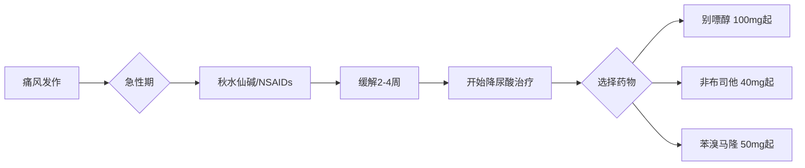

# 痛风用药参考

> 痛风常用药物信息速查表，便于快速了解药物作用和注意事项。

---

## 急性发作期药物（止痛消炎）

### 秋水仙碱（Colchicine）

| 项目 | 说明 |
|------|------|
| **作用** | 抑制炎症反应，缓解急性发作 |
| **用法** | 首剂1mg，1小时后0.5mg，12小时后0.5mg 每日1-2次 |
| **起效** | 12-24小时 |
| **常见副作用** | 腹泻、恶心、呕吐 |
| **注意事项** | 肝肾功能不全需减量；过量可致死 |
| **禁忌** | 严重肝肾功能不全 |

### 非甾体抗炎药（NSAIDs）

| 药物 | 剂量 | 特点 | 注意事项 |
|------|------|------|----------|
| **依托考昔** | 120mg 每日1次 | 胃肠道反应少 | 磺胺过敏禁用 |
| **塞来昔布** | 200mg 每日1-2次 | 胃肠道反应少 | 磺胺过敏禁用 |
| **双氯芬酸钠** | 50mg 每日2-3次 | 常用 | 饭后服用 |
| **布洛芬** | 300-400mg 每日3-4次 | 常见 | 胃肠道刺激 |
| **吲哚美辛** | 25-50mg 每日3次 | 强效 | 副作用较多 |

**NSAIDs 共同注意事项**：
- 活动性消化道溃疡禁用
- 肾功能不全慎用
- 建议饭后服用

### 糖皮质激素

| 药物 | 用法 | 适用情况 |
|------|------|----------|
| **泼尼松** | 30-40mg/日，3-5天递减 | NSAIDs禁忌或无效 |
| **地塞米松** | 0.5-1mg 肌注/口服 | 快速缓解 |

---

## 降尿酸药物（长期控制）

### 别嘌醇（Allopurinol）

| 项目 | 说明 |
|------|------|
| **作用** | 抑制尿酸生成 |
| **起始剂量** | 100mg 每日1次 |
| **目标剂量** | 300mg 每日1次（可调至600mg） |
| **达标时间** | 3-6个月 |
| **副作用** | 皮疹、胃肠道反应、肝功能异常 |
| **严重风险** | ⚠️ 过敏性休克、重症药疹 |
| **特殊人群** | eGFR<30ml/min 禁用或极低剂量 |

**重要提示**：亚洲人群需警惕 HLA-B*5801 相关严重皮疹，建议用药前基因检测。

### 非布司他（Febuxostat）

| 项目 | 说明 |
|------|------|
| **作用** | 抑制尿酸生成，效果强于别嘌醇 |
| **起始剂量** | 40mg 每日1次 |
| **目标剂量** | 40-80mg 每日1次 |
| **达标时间** | 2-4周 |
| **副作用** | 肝功能异常、恶心、关节痛（溶晶） |
| **优势** | 肾功能不全无需调整剂量 |
| **注意事项** | 心血管疾病史慎用 |

### 苯溴马隆（Benzbromarone）

| 项目 | 说明 |
|------|------|
| **作用** | 促进尿酸排泄 |
| **剂量** | 50-100mg 每日1次 |
| **适用** | 尿酸排泄减少型 |
| **禁忌** | 肾结石、重度肾功能不全 |
| **副作用** | 胃肠道反应、肝功能异常 |
| **注意事项** | 需多饮水，碱化尿液 |

---

## 辅助药物

### 碱化尿液药物

| 药物 | 剂量 | 目标 |
|------|------|------|
| **碳酸氢钠** | 1g 每日3次 | 尿pH 6.2-6.9 |
| **柠檬酸制剂** | 按说明书 | 尿pH 6.2-6.9 |

**作用**：提高尿pH，增加尿酸溶解度，预防肾结石

---

## 用药方案参考

### 初始治疗（未用药者）

### 降尿酸药物选择参考

| 情况 | 首选 | 次选 |
|------|------|------|
| 肾功能正常 | 别嘌醇 | 非布司他 |
| 肾功能不全 | 非布司他 | 别嘌醇（减量） |
| 尿酸排泄减少型 | 苯溴马隆 | 非布司他 |
| 别嘌醇过敏/不耐受 | 非布司他 | 苯溴马隆 |
| 有肾结石 | 非布司他 | 别嘌醇 |

---

## 用药监测

### 别嘌醇/非布司他监测

| 监测项目 | 频率 | 目标 |
|----------|------|------|
| 血尿酸 | 每2-4周 | <360 μmol/L |
| 肝功能 | 每3个月 | ALT/AST正常 |
| 肾功能 | 每3-6个月 | eGFR稳定 |

### 秋水仙碱监测

| 监测项目 | 频率 | 说明 |
|----------|------|------|
| 肝功能 | 长期使用时定期 | 监测毒性 |
| 血常规 | 长期使用时定期 | 监测骨髓抑制 |

---

## 常见问题

### Q1：降尿酸药要吃多久？
**A**：痛风是慢性病，通常需要长期甚至终身服用。尿酸达标后仍需维持用药。

### Q2：尿酸正常了能停药吗？
**A**：不建议突然停药，可能导致尿酸反弹。如需停药应在医生指导下逐渐减量。

### Q3：发作时能吃降尿酸药吗？
**A**：正在服用者继续服用，不要停。尚未开始者，建议急性期缓解2-4周后再开始。

### Q4：多种痛风药能一起吃吗？
**A**：降尿酸药通常只用一种。急性发作时可加用秋水仙碱或NSAIDs。碱化尿液药可与降尿酸药联用。

---

## 免责声明

本参考仅供信息查询，具体用药请遵医嘱：
- 药物使用需在医生指导下进行
- 剂量调整需根据个体情况和监测结果
- 出现不良反应应及时就医
- 本信息不能替代专业医疗建议
